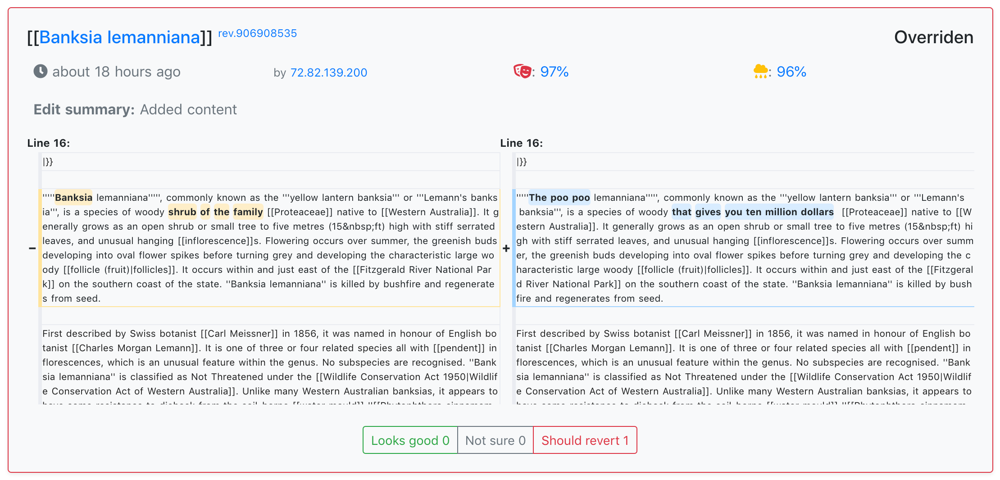

# WikiLoop Battlefield: Fight vandalism on Wikipedia together

[](https://meta.wikimedia.org/wiki/WikiProject_WikiLoop)

[](https://circleci.com/gh/google/wikiloop-battlefield/tree/master) 
[](https://img.shields.io/github/watchers/google/wikiloop-battlefield.svg?label=Watch&style=social)


This is a project of web app built to allow people to fight vandalism collaboratively. See [[[m:WikiProject_WikiLoop]]](https://meta.wikimedia.org/wiki/WikiProject_WikiLoop) for more introduction. The documentation in this repository focus on development of the software itself.

[](http://battlfield.wikiloop.org/?utm_source=github&utm_medium=markdown&utm_campaign=repo_readme_img)

## Website Status

[](http://battlefield.wikiloop.org/?utm_source=github&utm_medium=markdown&utm_campaign=repo_readme_up_badge)
[](http://battlefield.wikiloop.org/?utm_source=github&utm_medium=markdown&utm_campaign=repo_readme_up_ratio_badge)
[](http://dev.battlefield.wikiloop.org/?utm_source=github&utm_medium=markdown&utm_campaign=repo_readme_up_badge)
[](http://dev.battlefield.wikiloop.org/?utm_source=github&utm_medium=markdown&utm_campaign=repo_readme_up_ratio_badge)

## Contributor Instruction


 
[](https://stackshare.io/project-wikiloop/battlefield)

We welcome contributions! See [our contribution policy](CONTRIBUTING.md).

### Install & Setup development environment

* Step 1, you should install `node`([NodeJS](https://nodejs.org)), `npm`, and we recommend `nvm` to manage versions of your NodeJS runtime and environment.

* Step 2, fork and clone this repository. If you are new to [Git](https://git-scm.com/) and [Github](https://github.com), follow [this Git helloworld instruction](https://guides.github.com/activities/hello-world/) by Github

Example of a command to clone a copy.

```sh
git clone https://github.com/xinbenlv/wikiloop-battlefield-vue
```

* Step 3, standard npm install
```sh
cd <dir of your git cloned repository>
npm install 
```

* Step 4, setup `.env` file

You should have create a `.env` file containing environment variables needed by this project used by [`dotenv`](https://www.npmjs.com/package/dotenv). A template has been provided in the `template.env`. Once set, you should do `cp template.env .env` to create such file in the exact name. 

### Tests

Prerequisite: [Docker](https://www.docker.com/), [CircleCI](http://circleci.com)

```sh
npm test
```

```sh
circleci local execute build
```
