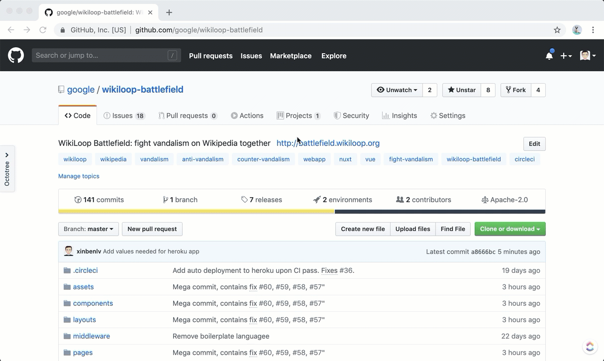

# WikiLoop Battlefield: Fight vandalism on Wikipedia together
<!-- ALL-CONTRIBUTORS-BADGE:START - Do not remove or modify this section -->
[](#contributors-)
<!-- ALL-CONTRIBUTORS-BADGE:END -->

[](https://meta.wikimedia.org/wiki/WikiProject_WikiLoop)

[](https://heroku.com/deploy)

[](https://circleci.com/gh/google/wikiloop-battlefield/tree/master) 
[](https://img.shields.io/github/watchers/google/wikiloop-battlefield.svg?label=Watch&style=social)


This is a web app project built to allow people to fight vandalism on Wikipedia collaboratively. See [[[m:WikiProject_WikiLoop]]](https://meta.wikimedia.org/wiki/WikiProject_WikiLoop) for more introduction. The documentation in this repository focuses on development of the software itself.

[](http://battlefield.wikiloop.org/?utm_source=github&utm_medium=markdown&utm_campaign=repo_readme_img)

## Website Status

[](http://battlefield.wikiloop.org/?utm_source=github&utm_medium=markdown&utm_campaign=repo_readme_up_badge)
[](http://battlefield.wikiloop.org/?utm_source=github&utm_medium=markdown&utm_campaign=repo_readme_up_ratio_badge)
[](http://dev.battlefield.wikiloop.org/?utm_source=github&utm_medium=markdown&utm_campaign=repo_readme_up_badge)
[](http://dev.battlefield.wikiloop.org/?utm_source=github&utm_medium=markdown&utm_campaign=repo_readme_up_ratio_badge)

## Quick Start


 
[](https://stackshare.io/project-wikiloop/battlefield)

We welcome contributions! See [our contribution policy](CONTRIBUTING.md). Please check out [our stack diagram](https://stackshare.io/project-wikiloop/battlefield) to get familiar with the technologies we depend on.
### Deploy a Dev Instance on Heroku

[](https://heroku.com/deploy)


 
### Install

Prerequisite: [git](https://git-scm.com), [nodejs](https://nodejs.org), [npm](https://npmjs.com)  

```bash
git clone git@github.com:google/wikiloop-battlefield.git
cd wikiloop-battlefield
npm install 
```

### Setup

You should create a `.env` file containing environment variables needed by this project used by [`dotenv`](https://www.npmjs.com/package/dotenv). A template has been provided in the `template.env`. Once set, you should do `cp template.env .env` to create such file in the exact name. 

### Run

Prerequisite: [NuxtJS](https://nuxtjs.org) with [VueJS](https://vuejs.org) and [ExpressJS](https://expressjs.com).

To run a local dev instance, which gives you hot reload and a devtool ([Vue DevTool](https://github.com/vuejs/vue-devtools)) friendly instance:

```bash
npm run dev
``` 

To build and run a local instance with like a prod:

```bash
npm run build
npm start
```
#### Deliver barnstar message (weekly as an example)

```
export REAL_RUN=1 # set real run to 1
cd mailer
$(curl --request GET "http://battlefield.wikiloop.org/api/stats/champion?endDate=$(date '+%Y-%m-%d')&timeRange=week&cmd=1")
```

### Test

Prerequisite: [Docker](https://www.docker.com/), [Jest](http://jestjs.io)

```bash
npm test
```

### Continuous Integration

Prerequisite: [CircleCI](https://circleci.com)

We run our continuous integration with CircleCI. To run continuous integration locally:

```bash
circleci local execute build
```

## Contributors ✨

Thanks goes to these wonderful people ([emoji key](https://allcontributors.org/docs/en/emoji-key)):

Add contributor through the following command

```shell script
npx all-contributors add $NEW_CONTRIBUTOR translation
```
<!-- ALL-CONTRIBUTORS-LIST:START - Do not remove or modify this section -->
<!-- prettier-ignore-start -->
<!-- markdownlint-disable -->
<table>
  <tr>
    <td align="center"><a href="http://keybase.io/xinbenlv"><br /><sub><b>xinbenlv</b></sub></a><br /><a href="https://github.com/google/wikiloop-battlefield/commits?author=xinbenlv" title="Documentation">📖</a> <a href="https://github.com/google/wikiloop-battlefield/commits?author=xinbenlv" title="Code">💻</a> <a href="#translation-xinbenlv" title="Translation">🌍</a> <a href="https://github.com/google/wikiloop-battlefield/issues?q=author%3Axinbenlv" title="Bug reports">🐛</a> <a href="#content-xinbenlv" title="Content">🖋</a> <a href="#ideas-xinbenlv" title="Ideas, Planning, & Feedback">🤔</a> <a href="#projectManagement-xinbenlv" title="Project Management">📆</a> <a href="#tutorial-xinbenlv" title="Tutorials">✅</a></td>
    <td align="center"><a href="https://epicfaace.github.io/"><br /><sub><b>Ashwin Ramaswami</b></sub></a><br /><a href="#infra-epicfaace" title="Infrastructure (Hosting, Build-Tools, etc)">🚇</a> <a href="https://github.com/google/wikiloop-battlefield/commits?author=epicfaace" title="Code">💻</a></td>
    <td align="center"><a href="https://www.facebook.com/hamdanil"><br /><sub><b>Hamdanil Rasyid</b></sub></a><br /><a href="#translation-hrasyid" title="Translation">🌍</a> <a href="https://github.com/google/wikiloop-battlefield/commits?author=hrasyid" title="Code">💻</a> <a href="https://github.com/google/wikiloop-battlefield/issues?q=author%3Ahrasyid" title="Bug reports">🐛</a></td>
    <td align="center"><a href="https://aligoren.com"><br /><sub><b>Ali GOREN</b></sub></a><br /><a href="#translation-aligoren" title="Translation">🌍</a> <a href="https://github.com/google/wikiloop-battlefield/issues?q=author%3Aaligoren" title="Bug reports">🐛</a> <a href="https://github.com/google/wikiloop-battlefield/commits?author=aligoren" title="Code">💻</a></td>
    <td align="center"><a href="https://github.com/ElanHR"><br /><sub><b>Elan</b></sub></a><br /><a href="https://github.com/google/wikiloop-battlefield/issues?q=author%3AElanHR" title="Bug reports">🐛</a></td>
    <td align="center"><a href="https://github.com/ExtremoBlando"><br /><sub><b>ExtremoBlando</b></sub></a><br /><a href="https://github.com/google/wikiloop-battlefield/issues?q=author%3AExtremoBlando" title="Bug reports">🐛</a></td>
    <td align="center"><a href="https://github.com/ChaoyueFred"><br /><sub><b>ChaoyueFred</b></sub></a><br /><a href="#video-ChaoyueFred" title="Videos">📹</a></td>
  </tr>
  <tr>
    <td align="center"><a href="http://simia.net"><br /><sub><b>Denny Vrandečić</b></sub></a><br /><a href="https://github.com/google/wikiloop-battlefield/issues?q=author%3Avrandezo" title="Bug reports">🐛</a></td>
    <td align="center"><a href="https://wisn.github.io/"><br /><sub><b>Wisnu Adi Nurcahyo</b></sub></a><br /><a href="https://github.com/google/wikiloop-battlefield/issues?q=author%3Awisn" title="Bug reports">🐛</a></td>
    <td align="center"><a href="https://curimit.com/blog"><br /><sub><b>curimit</b></sub></a><br /><a href="https://github.com/google/wikiloop-battlefield/issues?q=author%3Acurimit" title="Bug reports">🐛</a></td>
    <td align="center"><a href="http://www.andrew-g-west.com"><br /><sub><b>Andrew G. West</b></sub></a><br /><a href="#question-westand" title="Answering Questions">💬</a> <a href="#tool-westand" title="Tools">🔧</a></td>
    <td align="center"><a href="http://aiz.miga.lv"><br /><sub><b>Martins Brunenieks</b></sub></a><br /><a href="#translation-papuass" title="Translation">🌍</a></td>
    <td align="center"><a href="https://florian-koerner.com"><br /><sub><b>Florian Körner</b></sub></a><br /><a href="https://github.com/google/wikiloop-battlefield/commits?author=FlorianKoerner" title="Code">💻</a></td>
    <td align="center"><a href="https://github.com/dz-s"><br /><sub><b>dz_s</b></sub></a><br /><a href="#translation-dz-s" title="Translation">🌍</a></td>
  </tr>
</table>

<!-- markdownlint-enable -->
<!-- prettier-ignore-end -->
<!-- ALL-CONTRIBUTORS-LIST:END -->

This project follows the [all-contributors](https://github.com/all-contributors/all-contributors) specification. Contributions of any kind welcome!
